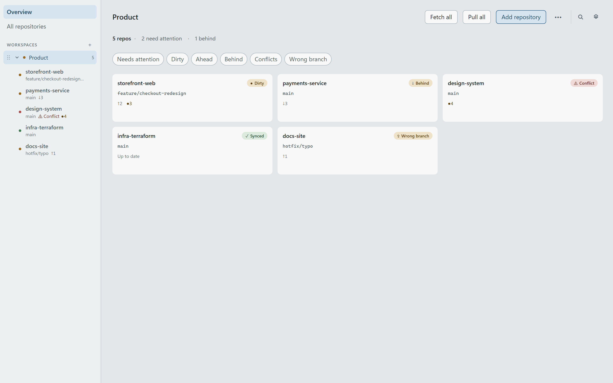
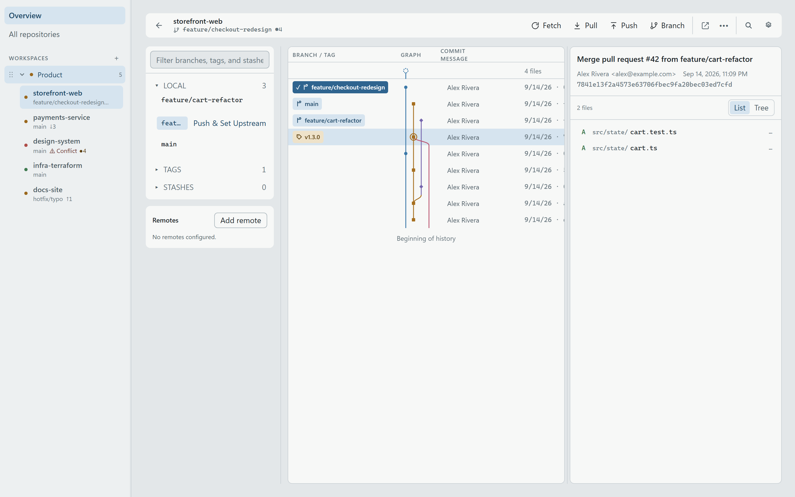
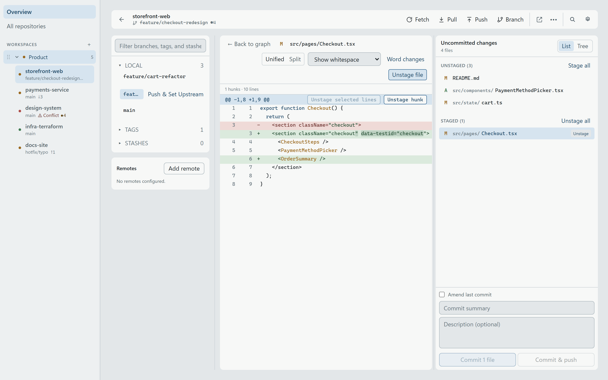
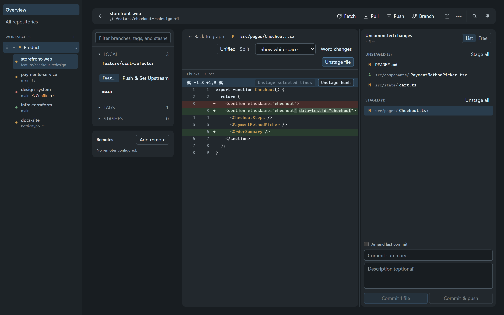

<p align="center">
  
</p>

<h1 align="center">Fjord</h1>

<p align="center">
  A fast desktop Git client for developers who work across many repositories.<br>
  Native app for Windows, macOS, and Linux.
</p>

<p align="center">
  <a href="README.md">English</a> · <a href="README.ru.md">Русский</a>
</p>

### Workspace overview



Repositories are grouped into workspaces. Every card shows the checked-out
branch, ahead/behind counts, uncommitted files, and conflicts, so the state of
all the projects you are touching fits on one screen. **Fetch all** and **Pull
all** run across the workspace concurrently.

### Repository history



Opening a repository gives you a commit graph with real branch and merge
topology, local and remote branches, tags and remotes on the left, and an
inspector on the right listing the files a commit touched.

### Staging and diffs



Working changes are split into staged and unstaged, shown as a flat list or a
tree. Whole files, single hunks, or selected lines can be staged, unstaged, or
discarded; commit, amend, or commit and push from the same panel.

### Themes and languages



Light, dark, or system theme, and English, Russian, German, French, and Spanish
— all switchable at runtime in **Settings**.

## What you get

- **Workspaces instead of one repository at a time.** Group repositories the way
  you think about your projects, not the way they sit on disk.
- **One dashboard for everything you touch.** Branch, ahead/behind, dirty files,
  and conflicts for every repository, refreshed in the background by a file
  system watcher rather than by polling.
- **Bulk operations.** Fetch, pull, or open a whole workspace in your IDE in one
  action, executed concurrently over a bounded worker pool.
- **A real commit graph.** Branch and merge topology, not a flat list, with an
  inspector for every commit and its files.
- **Line-level staging.** Stage, unstage, or discard whole files, single hunks,
  or hand-picked lines, with unified and split diff views.
- **Your Git credentials, untouched.** Network operations run through your system
  Git, so credential helpers, SSH agents, proxies, and corporate certificates
  keep working. Fjord stores no passwords, tokens, or keys.
- **Undo for dangerous things.** Destructive actions are preflighted with their
  exact consequences, and a reflog-based Recovery Center brings work back.
- **Keyboard-first.** Command palette (`⌘K` / `Ctrl+K`), repository switcher, and
  global search across repositories, branches, and commits.
- **Quiet and native.** A Rust core behind a native webview: small install, low
  idle cost, no bundled browser.

## Not in Fjord yet

Fjord is an Early Preview and is honest about its gaps. These are designed and on
the roadmap ([`docs/tasks.md`](docs/tasks.md)), not shipped:

- **Starting a merge or a rebase.** Fjord *detects* an in-progress merge, rebase,
  cherry-pick, or revert — including one started in a terminal — lists the
  conflicts, hands off to your merge tool, and can continue, skip, or abort it.
  It cannot yet begin one; `git merge` and `git rebase` still start elsewhere.
- **File actions in Working Changes.** A changed file can be staged, unstaged,
  and discarded. There is no right-click menu yet for opening the file, revealing
  it, ignoring it, exporting a patch, or deleting it.
- **Full remote management.** Remotes can be listed and added; editing, renaming,
  and removing them are not implemented.
- **Worktrees, interactive rebase, and forge integration** (pull requests, issues,
  CI dashboards). The last of these is a deliberate non-goal, not a backlog item.

## Performance

Reads are bounded by design: history and diffs are paged, status and history are
cached, repository switches restore from a persisted snapshot before live Git
work starts, and syntax highlighting happens off the render path in a worker.

Measured on synthetic fixtures in a release build:

| Scenario | Result |
|---|---|
| Open repository (50k commits) | 0.5 ms |
| Status (50k commits, 200 files) | 3.5 ms |
| History page, 200 commits of 50k | 9.7 ms |
| Live status refresh, 24 repositories | 62 ms |
| Cached dashboard read, 24 repositories | 0.1 ms |
| Global search across 24 repositories | 57 ms |
| First diff window on a giant packed diff (P95) | 34.6 ms |

Full runs, fixtures, and the regression reporting live in
[`docs/benchmarks/`](docs/benchmarks/).

## Install

Fjord runs on **Windows 11 x64**, **macOS 13+** (Intel and Apple Silicon), and
**Ubuntu 22.04+ x64**. Grab the signed Windows installer, the notarized macOS
package, or the Linux AppImage from the
[Releases page](https://github.com/TheZan/Fjord/releases).

## Build from source

Requires Node.js 22+, stable Rust, system Git, and the
[Tauri prerequisites](https://v2.tauri.app/start/prerequisites/):

```bash
npm ci
npm run tauri dev
```

## Git and authentication

Fetch, the network phase of pull, push, and remote branch operations run through
your installed system Git, so your existing credential helpers (such as Git
Credential Manager), SSH agent and config, proxy, and certificate setup keep
working. Fjord stores no passwords, tokens, or private keys. When Git or SSH
still needs input, a bundled one-shot askpass helper shows a native prompt for
that one operation.

**Settings → Git** shows the resolved executable and version, the credential
environment, lets you point at a different Git binary, and runs a read-only
connection test.

If a remote operation fails:

- **Git not found** — install Git or select its executable in Settings → Git.
- **Authentication failed** — configure your provider's recommended credential
  helper, then re-run the connection test. Fjord does not accept or store a PAT.
- **SSH key not found** — check `ssh-add -l`, `SSH_AUTH_SOCK`, and `~/.ssh/config`.
- **Host key verification failed** — connect once with `ssh` in a terminal and
  verify the fingerprint. Fjord never bypasses host key checks.
- **Certificate or proxy error** — fix the system Git `http.ssl*` / `http.proxy`
  configuration. Fjord does not modify global Git config.
- **More detail** — expand **Raw diagnostics** after a failed connection test.
  Logs live in the platform app-data directory under `logs`, with credentials
  redacted.

## Contributing

Small, focused contributions and issue reports are welcome. See
[`CONTRIBUTING.md`](CONTRIBUTING.md) for local setup and the checks a change has
to pass; the architecture and subsystem contracts are documented in
[`docs/SDD.md`](docs/SDD.md) and [`docs/specs/`](docs/specs/). Report bugs with
the GitHub issue templates; report vulnerabilities privately as described in
[`SECURITY.md`](SECURITY.md), and never attach credentials or private repository
contents to a public issue.

## License

[MIT](LICENSE-MIT).
