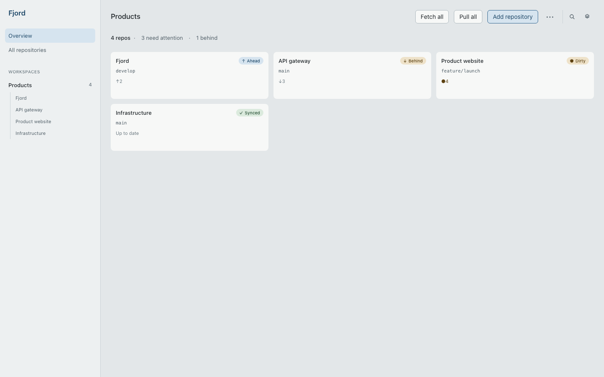

<p align="center">
  
</p>

<h1 align="center">Fjord</h1>
<p align="center">Git workspace manager — не просто ещё один Git-клиент.</p>

<p align="center">
  <a href="README.md">English</a> · <a href="README.ru.md">Русский</a>
</p>

<p align="center">
  <a href="#лицензия"></a>
  
  
  
  
</p>

---

> [!WARNING]
> **Fjord v0.1 — ранняя предварительная версия.** Используйте обычные резервные
> копии Git и внимательно проверяйте каждое подтверждение опасного действия.
> Публичные пакеты появятся только после прохождения release gate и проверок на
> чистых машинах.

## Скачать и установить

Fjord рассчитан на **Windows 11 x64**, **macOS 13+** (Intel и Apple Silicon) и
**Ubuntu 22.04+ x64**. После прохождения fail-closed checklist подписанный
Windows installer, notarized-пакет macOS и Linux AppImage появятся на странице
[GitHub Releases](https://github.com/TheZan/Fjord/releases). В v0.1 нет
автоматической установки обновлений.

Для сборки из исходников нужны Node.js 22+, stable Rust, системный Git и
[зависимости Tauri v2](https://v2.tauri.app/start/prerequisites/):

```bash
npm ci
npm run tauri dev
```



_Экран собран из поставляемого UI на локальных демонстрационных данных; данных
приватных репозиториев на изображении нет._

Большинство Git-клиентов рассчитаны на то, что вы смотрите на один репозиторий. На практике рабочий день охватывает сразу несколько — бэкенд-сервис, фронтенд, немного инфраструктурных конфигов — и вопрос «что вообще сейчас происходит во всех проектах, с которыми я работаю» ни один однорепозиторный инструмент толком не решает.

Fjord отталкивается от рабочего пространства, а не от отдельного репозитория. Группируйте репозитории так, как вы сами думаете о своих проектах, видьте состояние всех сразу на одном экране, а когда нужны детали — открывайте любой репозиторий отдельно, с полной историей веток и коммитов.

## Возможности

- **Рабочие пространства (Workspaces)** — группируйте репозитории так, как удобно вам, а не так, как они лежат на диске.
- **Единый дашборд** — ветка, ahead/behind, наличие изменений и конфликтов по каждому репозиторию рабочего пространства — сразу видно.
- **Массовые операции** — fetch, pull или открытие всего рабочего пространства в IDE одним действием, параллельно, а не по очереди.
- **Полноценный просмотр репозитория** — ветки, настоящий граф коммитов с топологией веток и слияний, diff'ы и инспектор коммита.
- **Командная палитра** (⌘K / Ctrl+K) и глобальный поиск по репозиториям, веткам и коммитам.
- **Ограниченная по объёму работа с репозиториями** — кэши статуса/истории,
  постраничные история и diff, а также измеряемые fixture-бенчмарки не допускают
  тяжёлые чтения в render path.
- **Светлая, тёмная или системная тема.**
- **Русский, английский, немецкий, французский и испанский**, переключаются на лету.
- **Нативное кроссплатформенное приложение** — быстро и незаметно работает на Windows, macOS и Linux.

## Git и авторизация

Для fetch, сетевого этапа pull, push и операций с удалёнными ветками Fjord
использует установленный системный Git. Поэтому продолжают работать ваши Git
Credential Manager, credential helpers, SSH agent/config, proxy и сертификаты.
Fjord не хранит пароли, токены и приватные ключи. Если Git или SSH всё же нужен
ввод, встроенный одноразовый askpass показывает нативное окно Fjord только для
текущей операции.

В **Настройки → Git** можно увидеть путь и версию Git, проверить окружение,
выбрать другой executable и выполнить read-only проверку подключения.

### Диагностика сетевых операций

- **Git не найден:** установите Git или выберите executable в Настройки → Git.
- **Ошибка авторизации / нет credential helper:** настройте рекомендованный
  хостингом helper (например, Git Credential Manager) и проверьте подключение.
  Fjord не принимает и не сохраняет PAT в настройках.
- **SSH-ключ не найден:** проверьте `ssh-add -l`, `SSH_AUTH_SOCK` и `~/.ssh/config`.
- **Ошибка host key:** подключитесь через `ssh` в терминале и сверьте fingerprint
  сервера перед подтверждением; Fjord не отключает проверку host key.
- **Ошибка сертификата или proxy:** исправьте системные настройки Git
  `http.ssl*`/`http.proxy` или корпоративное хранилище доверия. Fjord не меняет
  глобальный Git config.
- **Подробности:** раскройте **Raw diagnostics** после неудачной проверки.
  Логи приложения находятся в каталоге app-data платформы, в папке `logs`;
  диагностика ограничена по размеру, credentials редактируются.

## Стек технологий

| | |
|---|---|
| **Desktop-обёртка** | [Tauri v2](https://tauri.app/) — нативный webview, не Electron |
| **Backend** | Rust, [Tokio](https://tokio.rs/) |
| **Git-движок** | [`gix`](https://github.com/GitoxideLabs/gitoxide) для локального чтения, [`git2`](https://github.com/rust-lang/git2-rs) для локальных изменений, системный Git для всего сетевого transport |
| **Хранение данных** | SQLite через [`sqlx`](https://github.com/launchbadge/sqlx) |
| **Frontend** | React, TypeScript, [Vite](https://vitejs.dev/) |
| **UI** | Tailwind CSS v4, собственные UI-примитивы |
| **Слой данных** | Типизированный клиент Tauri IPC + [TanStack Query](https://tanstack.com/query) |
| **Локализация** | react-i18next |

## Что входит в Early Preview

В кандидат v0.1 входят onboarding рабочих пространств и репозиториев,
clone/create, статус и история, staged/unstaged и частичная работа с hunks,
commit/amend, операции с ветками/тегами/stash, fetch/pull/push, явное **Отправить
и задать upstream**, управление незавершёнными операциями, preflight опасных
действий и Recovery Center на основе reflog. Чувствительные сетевые операции
выполняет установленный системный Git.

Пока не входят: аккаунты/OAuth Git-хостингов, создание репозитория у провайдера,
pull requests/issues, полный remote CRUD, worktrees, interactive rebase, плагины,
cloud sync и командная работа.

Цели фаз и зависимости — в [`docs/SDD.md`](docs/SDD.md) §15; детальный статус по задачам — в [`docs/tasks.md`](docs/tasks.md); контракты подсистем — в [`docs/specs/`](docs/specs/).

## Участие в разработке

Fjord всё ещё на ранней стадии, но небольшие и сфокусированные вклады и issue reports приветствуются. Настройка окружения, проверки и порядок выбора задач описаны в [`CONTRIBUTING.md`](CONTRIBUTING.md).

Для воспроизводимых ошибок используйте шаблоны GitHub Issues. Об уязвимостях
сообщайте приватно по инструкции в [`SECURITY.md`](SECURITY.md); не прикладывайте
к публичным issue credentials, содержимое приватных репозиториев и полные diff.

## Лицензия

Fjord распространяется под двойной лицензией — на выбор:

- MIT license ([LICENSE-MIT](LICENSE-MIT))
- Apache License, Version 2.0 ([LICENSE-APACHE](LICENSE-APACHE))
